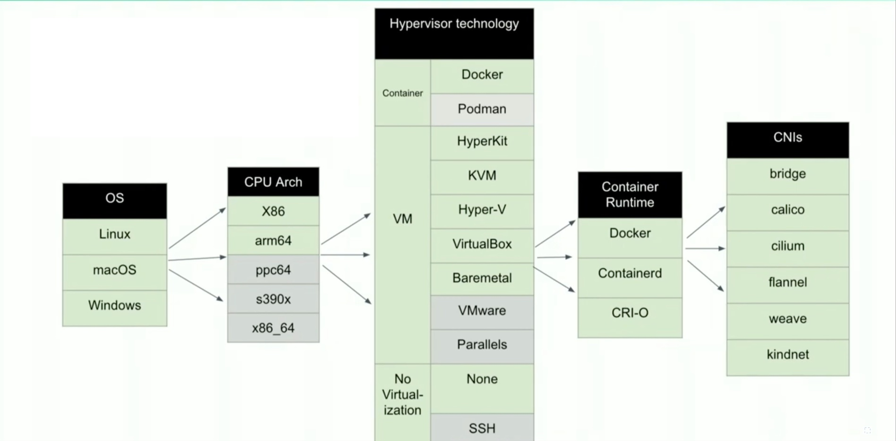

<style>
pre > code {
    min-width: 900px;
    padding: 0.5rem;
    line-height: 1.5;
  }
</style>

## What is Minikube?

---

Fully-featured Kubernetes cluster designed for local development and testing.

---

The most configurable Kubernetes tech stack.



---

### Drivers

Minikube requires a Linux Virtual Machine because it runs Linux containers.

---

### minikube CLI

---

### Kubernetes dashboard

```sh
minikube dashboard
```

---

### Copying and Mounting Files

```sh
minikube cp
minikube mount
```

---

### Accessing Applications

```sh
minikube service
minikube tunnel
```

---

### Troubleshooting

---

To reset Minikube:

```sh
minikube delete
minikube start
```

---

To reset everything:

```sh
colima delete
colima restart
minikube start
```

---

### Q&A