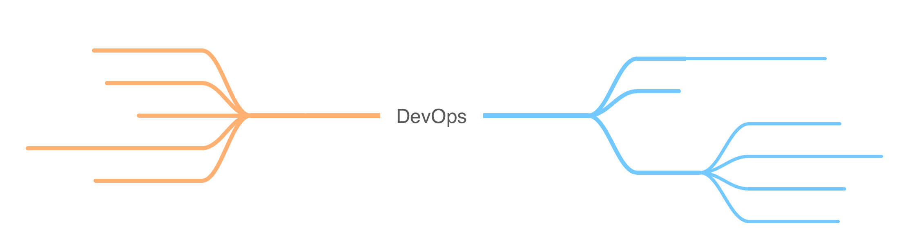
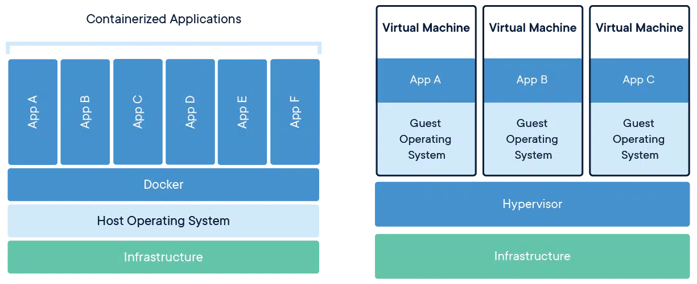

<style>
pre > code {
    min-width: 900px;
    padding: 0.5rem;
    line-height: 1.5;
  }
</style>

## DevOps and Containerization

---

### DevOps

A set of principles, technologies, and processes for maximizing developer productivity and collaboration with Operations teams.

---



---

## DevOps Concepts

---

### Collaboration

Developers and Operations teams working closely together to automate and standardize the software development lifecycle.

---

### Automation

Codify any manual processes.

Machines are better at repetitive tasks than humans.

---

### GitOps

Everything under source control.

Use source control events to trigger CI/CD workflows.

---

### Infrastructure As Code

Describe the desired state of your infrastructure using a configuration based language.

---

### Observability

Application logging and introspection at scale without the need to directly access the application.

---


---

### CI/CD

Building and deploying applications should be simple, fast, and automated.

Powered by GitOps.

---

### Containerization

How we went from Virtual Machines to Containers.

---

### Virtual Machines

The old unit of a service.

Slow. Complex. Poor resource utilization.

---

### Containers

The new unit of a service.

Fast. Simple. Multiple containers in a single VM.

---

### Virtual Machines vs Containers



---

### How did we get to containers?

Service Oriented Architecture and Microservices.

---

### Monolith

One massive application that runs in a single VM.

---

### Microservice

Smaller modular application responsible for a specific purpose and function.

---

### Service Oriented Architecture

Architectural approach to systems design to meet enterprise scale challenges.

---

#### Service Oriented Architecture

- Modular
- Scalable
- Discoverable
- Interoperable
- Loosely coupled

---

Kubernetes is built upon the principles of Service Oriented Architecture.

---

### Back to Containerization

---

When applications became smaller and more focussed, they became simpler.

---

They could be run from a single process, and didn't require a full-blown OS.

---

Instead of one application sitting inside a Virtual Machine.

---

We could deploy many containers inside a single Virtual Machine.

---


---

### What are Containers?

A lightweight alternative to Virtual Machines.

---

### Linux Containers

- Isolated environments within the same OS.

- OS-specific implementations

- Deep knowledge of Linux internals required.

- Only focussed on runtime isolation.

---

### Containerization History

---

How Docker and containers (as we know them) were born.

---

A company dotCloud used LXC containers for application deployments in their cloud hosting PaaS.

---

The suite of tools and APIs they developed were called Docker and were open sourced in 2013.

---

### Containers Changed the World

Docker created an open source container ecosystem that made containers accessible to everyone.

---

1. Dockerfile
2. Build Image
3. Push Image to Registry
4. Pull Image
5. Run Container

---

### Containers are Immutable

Containers are stateless and ephemeral.

Think of them as an executable.

---

### Container Image

An immutable artifact that when run, becomes a container.

---

An image is like a class in an Objected-oriented language.

A container is like an instance of a particular class.

---

### Image Types

- Official
- Community
- Internal/Private

---

### Which Image Type to Use?

Reddit will have strict guidelines on this.

Only use Community images for education.

---

### Image Tags

Different versions and variations.

---

### Live coding

Let's run some containers!

We'll be using the Docker container runtime for convenience here.

---

Running an NGINX container:

```sh
docker run -p 8080:80 nginx:alpine
```

---

Run a Python container with a custom command:

```sh
docker run \
  -p 8000:8000 \
  python:alpine \
  python -um http.server
```

---

Learn about Linux with an Ubuntu container:

```sh
docker run \
  -it \
  ubuntu
```

---

Build and run a custom container:

```sh
cd labs/containers/devjokes

docker image build -t devjokes .

docker run -p 8000:8000 devjokes
```

Open browser at http://localhost:8000

---

Use Minikube to build and run a custom container:

```sh
minikube image build -t devjokes .

kubectl run --image devjokes --image-pull-policy IfNotPresent

kubectl port-forward devjokes 8000:8000
```

Open browser at http://localhost:8000

---

### Clean-up

```sh
docker container prune -f
```

### Summary

---

DevOps, Service Oriented Architecture, and containers revolutionized how applications are built and deployed.

---

We know Containers are the way to run applications, but where do we run them and how?

---

That's where Kubernetes comes in!

---

### Q&A
