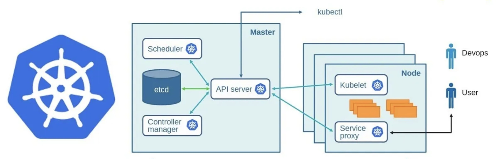

<style>
pre > code {
    min-width: 900px;
    padding: 0.5rem;
    line-height: 1.5;
  }
</style>

## Kubernetes Architecture

---

### What is Kubernetes?

---

An open-source container orchestration platform.

---

### What Does Kubernetes Do?

Automates the deployment, scaling, management, and operation of containerized applications.

---

## The Simple Version

- Describe in YAML how to host your containerized application.

- Send that YAML to Kubernetes.

- Kubernetes figures how to make that happen.

---

### History

Kubernetes was developed by engineers at Google as an open-source project based on their internal systems for managing containers.

---

### Why we need Kubernetes?

---

- Running containers on a single machine is easy.

- Running containers at scale across a fleet of machines is not.

---

### What Does Kubernetes Provide?

---

#### Container Orchestration

---

#### Hosts Any Type of Application

---

#### Service Discovery and Load Balancing

---

#### High Availability

---

#### Scalability

---

#### Deployment Rollouts and Rollbacks

---

#### Declarative Configuration

---

#### Built-in Secrets and Configuration Management

---

#### Cloud and Infrastructure Agnostic

---

#### Self-Healing

---

#### Increased Resource Utilization

---

#### Fully Extensible

---

### Flexible

---

### Distributed Systems Toolkit

---

### How Does Kubernetes Work?

Manages resources using a control loop.

---

### Control Loops in the World

Cruise Control.

---

### Kubernetes is a State Machine

You tell it what you want (declarative).

Not what to do (imperative).

---

### Declarative vs Imperative

Only use Kubernetes in a declarative fashion.

---

### Declarative vs Imperative

Resources stored in YAML in your code base should always match the objects stored in Kubernetes.

---

### Kubernetes Architecture



---

### Resources

Kubernetes is centered around Resources.

The Controller Manager controls the lifecycle of these Resources.

---

### Anatomy of a Resource

- API Version
- Kind
- Metadata
  - Name
  - Labels

<style>
    ul {
        margin: 0 100px;
    }

    ul ul {
        margin-left: auto;
    }
</style>

---

### Pod example

```yaml
apiVersion: v1
kind: Pod
metadata:
  name: nginx
  labels:
    app: nginx
spec:
  containers:
    - name: nginx
      image: nginx
      ports:
        - name: https
          containerPort: 443
```

---

### Kubernetes Objects

Most Kubernetes Resources are Objects.

---

### Inspect Minikube Cluster

```sh
# See cluster status
kubectl cluster-info

# View nodes
kubectl get nodes

# View status of control plane components
kubectl get componentstatus

# List the available resources for this cluster
kubectl api-resources

# Let's use the Kubernetes dashboard to explore the cluster
minikube dashboard
```

---

### Summary

Kubernetes is a container orchestration platform that uses a declarative model to describe the desired state of your application to the cluster.

---

### Q&A