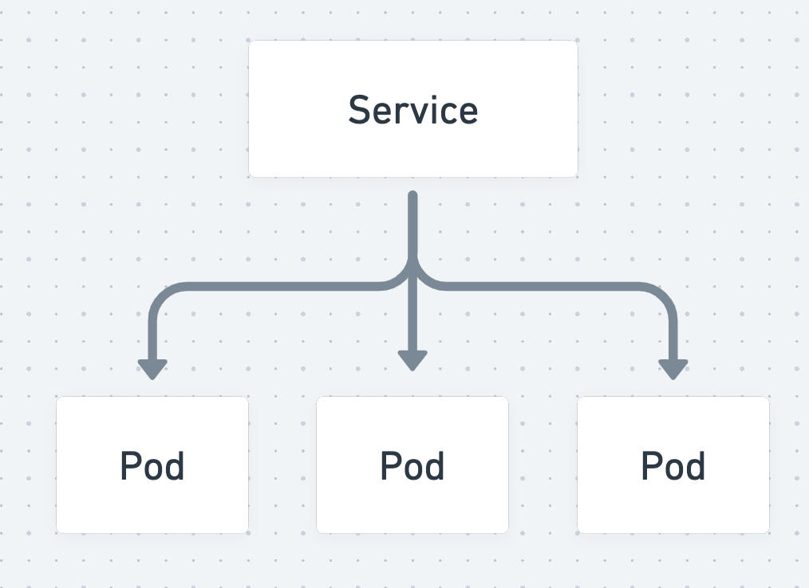

<style>
pre > code {
    min-width: 900px;
    padding: 0.5rem;
    line-height: 1.5;
  }
</style>

## Services

---

Expose your application to the Kubernetes and beyond.

---

A Service dynamically distributes traffic to a specific group of Pods based on label selectors.

---



---

```yaml
apiVersion: v1
kind: Service
metadata:
  name: nginx
spec:
  selector:
    app: nginx
  ports:
    - protocol: TCP
      port: 80
      targetPort: 80
```

---

### Service Types

- ClusterIP
- NodePort
- Load Balancer

---

### ClusterIP (standard)

Provides an internal Cluster IP address and hostname.

Only accessible within the Kubernetes Cluster.

---

### Lab

```sh
# 1. Create Service without endpoints
kubectl apply -f labs/nginx-service-cluster-ip.yaml 

# 2. Create an NGINX pod with `app=nginx` label
kubectl run nginx --image nginx --labels="app=nginx"


# 3. Debug Pod to test DNS
kubectl run debug --rm -it --image alpine -- sh
# >> nslookup nginx
```

---

### NodePort (advanced)

Makes the service publicly accessible by allocating a port on every Node for reaching that service.

---

### Load Balancer

Standard method of exposing a Kubernetes service to the public internet.

Requires integration with your infrastructure provider.

---

### Lab

```sh
# 1. Create Load Balancer Service
kubectl apply -f labs/nginx-service-load-balancer.yaml


# 2. Expose Load Balancer 
minikube tunnel

# 3. Access NGINX locally
open http://localhost
```

---

### Headless Service

When you don't need load balancing for your service.

Example: When the Service IP will resolve to a single Pod.

---

### Code Challenges

1. Create a ClusterIP Service named `devjokes` for the devjokes Pod and access it using `minikube service devjokes --url`

2. Change the Service to `LoadBalancer` and access it using `minikube tunnel`.

3. Create a Service for MySQL or PostgreSQL